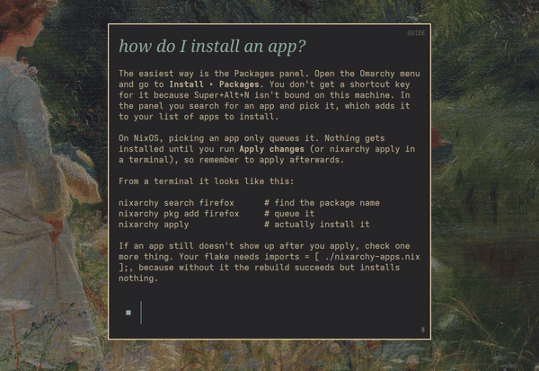
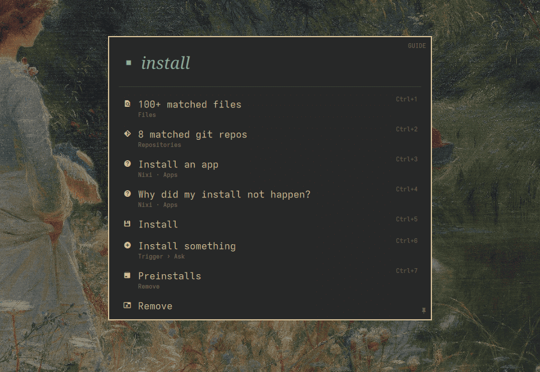
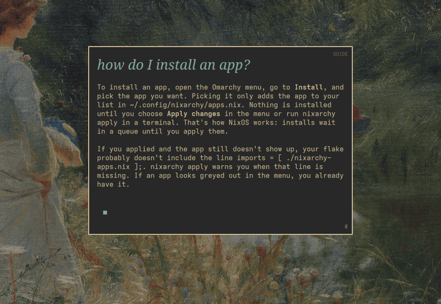
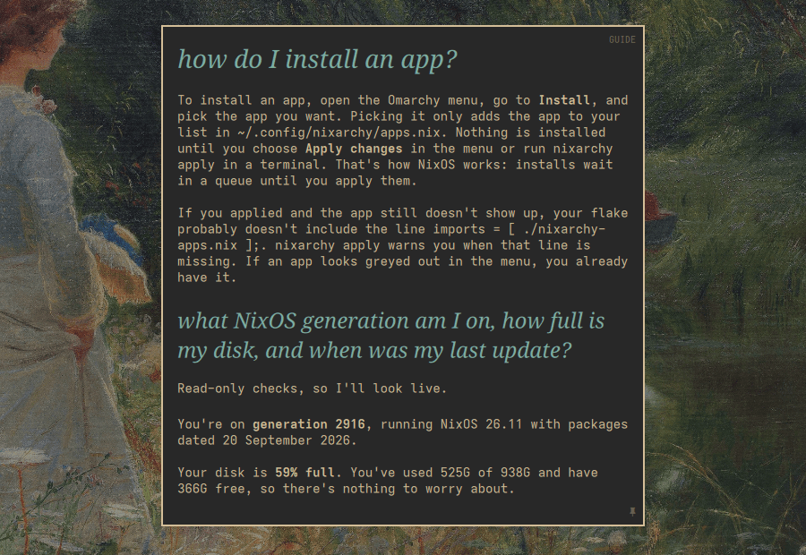
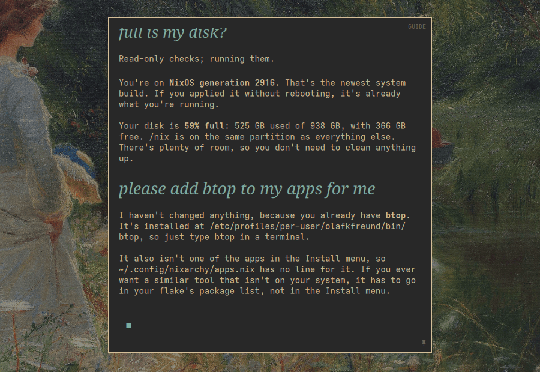
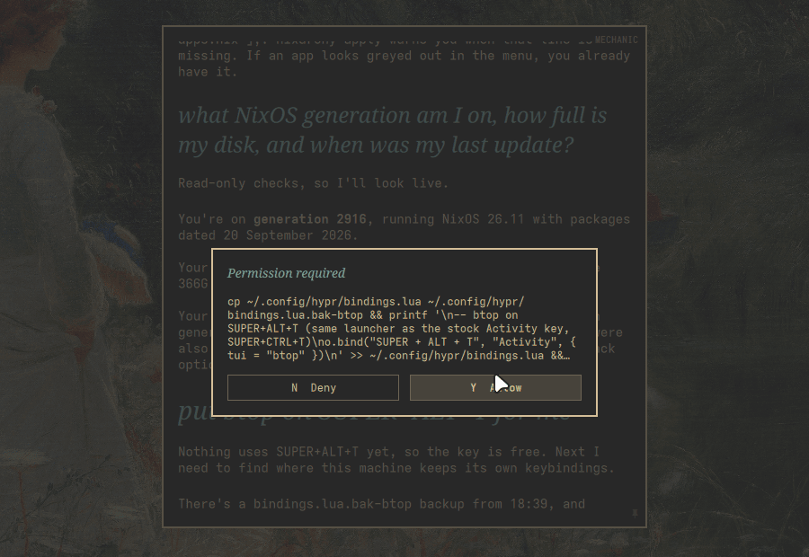
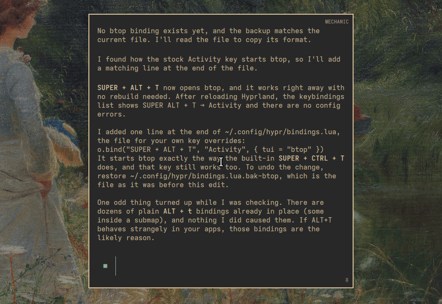
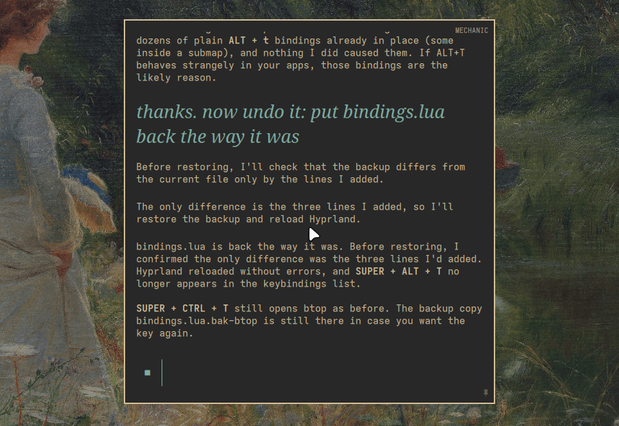

<h1 align="center">✨ Nixi</h1>
<p align="center"><em>Your nixarchy guide — a guided tour, a learning path, and an AI tutor that actually knows your machine.</em></p>
<p align="center"><a href="https://olafkfreund.github.io/nixi-nixarchy/"></a></p>

Nixi is an Omarchy overlay card: press a key, ask "how do I…" about
[nixarchy](https://github.com/olafkfreund/nixarchy), and it answers — the keys,
the menu, workspaces, themes, and the part that trips up every newcomer:
**packages are declarative here**.

The card is [omarchy-ask](https://github.com/clickety-clacks/omarchy-ask)'s
interface, rebranded, with Nixi's features inside it: answers grounded in the
local nixarchy manual, a hands-on tour, a learning path, and two trust levels.
The tour, the learning path and the FAQ need **no AI and no network**; connect
an agent and the same card becomes a tutor.

> Nixi began as a fork of [Archy](https://github.com/respira-crece-lidera) by
> Luke Warren Wills, retargeted from Omarchy/Arch to nixarchy/NixOS. The
> history is in [docs/FORK.md](docs/FORK.md).

---

## A first session

Sam has just installed nixarchy, and knows Arch but not NixOS. This is one real
session (Nixi 0.10.0, Claude Code, NixOS 26.11), captured as it happened. The
[site](https://olafkfreund.github.io/nixi-nixarchy/) has the full recording.

| | |
|---|---|
|  | **1. Open it.** Sam clicks the ✨ in the bar and types `install`. Before any AI is involved, the card matches Omarchy menu entries, apps, files and repositories. Enter sends the text as a question. |
|  | **2. Ask.** "How do I install an app?" The answer is nixarchy's, not `pacman -S`: pick it from **Install**, which adds it to `~/.config/nixarchy/apps.nix`, and nothing happens until **Apply changes** (`nixarchy apply`). It comes from the local manual Nixi searches before every question. |
|  | **3. Ask about the machine.** "What generation am I on, how full is my disk?" Nixi runs read-only checks and answers with this laptop's numbers, which matched `readlink /nix/var/nix/profiles/system` and `df`. |
|  | **4. Guide changes nothing.** Asked to add btop, Nixi explains instead: btop is already installed. In Guide the bridge cancels every permission request. |
|  | **5. Mechanic asks first.** After `/mechanic`, "put btop on SUPER+ALT+T" is done step by step, and each step needs **Allow**. Click the buttons: Y and N [do not work yet](https://github.com/olafkfreund/nixi-nixarchy/issues/20). Mechanic also asks before read-only lookups, and a long command can be [cut short in the prompt](https://github.com/olafkfreund/nixi-nixarchy/issues/21), so read the agent's message too. |
|  | **6. Checked.** One line is added to `~/.config/hypr/bindings.lua`. Nixi reloads Hyprland, confirms the live binding, and says where the backup is. |
|  | **7. Undo.** "Now undo it." Nixi restores its backup and checks the binding is gone. `/guide` makes it read-only again. |

With no agent at all: `/tour` ([step 2](docs/media/08-tour.png)), `/learn`
([a lesson](docs/media/09-learn.png)) and the [calculator](docs/media/10-calculator.png).
The FAQ rows show up in search too, but choosing one
[does nothing yet](https://github.com/olafkfreund/nixi-nixarchy/issues/19).

---

## Install

### nixarchy

Nothing to do: nixarchy ships Nixi on (`services.nixi.enable = true`), and the
first switch turns the card and its bar button on for you. That happens once:
if you turn Nixi off in **Setup > Plugins**, it stays off, and SUPER+H tells
you where to turn it back on.

### Any NixOS / Home Manager setup — the flake

```nix
{
  inputs.nixi.url = "github:olafkfreund/nixi-nixarchy";
  inputs.nixi.inputs.nixpkgs.follows = "nixpkgs";
}
```

```nix
{
  imports = [ inputs.nixi.homeModules.default ];
  services.nixi.enable = true;
}
```

Rebuild. The card and the bar button are turned on for you on the first switch
(`services.nixi.autoEnable`).

| option | default | what it does |
|---|---|---|
| `services.nixi.enable` | `false` | The card, the grounding knowledge, the state directory |
| `services.nixi.agents` | `[ "claude" "codex" ]` | Agents whose ACP adapter is pinned from your `pkgs`: `claude`, `codex`, `opencode`. One that cannot be built here is skipped with a warning |
| `services.nixi.autoEnable` | `true` | Turn the card and button on in the Omarchy shell on the first switch (once) |
| `services.nixi.barWidget.enable` | `true` | The sparkles button (a second plugin) |
| `services.nixi.skill.enable` | `true` | Tutor skill into `~/.claude/skills/nixi` |
| `services.nixi.manual.autoUpdate` | `true` | Weekly refresh of the local manuals |
| `services.nixi.manual.onCalendar` | `"weekly"` | When that refresh runs |
| `services.nixi.watcher.enable` | `false` | Notices features you don't use, ≤1 tip/day |
| `services.nixi.omarchyHooks.enable` | `false` | First-boot welcome + refresh after `omarchy update` |
| `services.nixi.menuEntry.enable` | `false` | Adds "Help" to the Omarchy menu (SUPER+SPACE) |
| `services.nixi.menuEntry.extraEntries` | `{}` | Your own menu entries, merged alongside Nixi's |

Claude Code is Nixi's default agent: it is used whenever Omarchy has no default
agent and you have not picked one with SUPER+,. Its adapter, `claude-agent-acp`,
is Apache-2.0 but depends on the unfree `claude-code`, so pinning it needs
unfree allowed. Nixi decides that by trying to build the adapter rather than by
reading your config, and an agent it cannot build is skipped with a warning at
rebuild time — naming the agent and what to do — instead of failing the build.
A skipped agent still works if its adapter is on `PATH`, as does any agent left
out of the list.

`menuEntry.enable` makes Nix the owner of
`~/.config/omarchy/extensions/omarchy-menu.jsonc`; move any entries you wrote
by hand into `menuEntry.extraEntries` first.

Upgrading from 0.9.x: `services.nixi.port` and `services.nixi.voice` are gone,
and evaluation says so if you still set them.

### The Omarchy plugin manager

```
omarchy plugin add https://github.com/olafkfreund/nixi-nixarchy.git --enable
~/.config/omarchy/plugins/io.github.olafkfreund.nixi/install.sh
```

The plugin manager puts the card in place; `install.sh` fetches the bridge's npm
dependencies, installs the bar button, and places `nixi` in `~/.local/bin`. It
also removes a 0.9.x install (the old server, its unit, the browser page and
the voice models). It then tells you which agent adapters it found on `PATH` —
on NixOS add `pkgs.claude-agent-acp`, `pkgs.codex-acp` or `pkgs.opencode` to
your configuration, plus `pkgs.nodejs` and `pkgs.fd`.

`--all` adds every optional integration; `--with-watcher`, `--with-skill` and
`--with-hooks` enable them one at a time. Every placement is atomic and
journalled, so a failure restores exactly what was there before.

---

## Using it

| | |
|---|---|
| **Open it** | The ✨ in the bar, `nixi`, or SUPER+SPACE → Help. Bind a key if you like: `o.bind("SUPER + H", "Nixi", "nixi")` in `~/.config/hypr/bindings.lua` |
| **Ask** | Type and press Enter. The card opens empty — nothing appears until you ask |
| **Search first** | While you type, FAQ answers, the Tour, the Learning path, Omarchy menu entries and apps appear as rows. `@` searches files, `^` repositories, `%` windows |
| **Tour** | `/tour`, or `nixi --tour`. Eleven steps that watch Hyprland events, so a step completes when you actually did it. Close the card mid-tour; `/tour` resumes where you were |
| **Learning path** | `/learn` teaches the next of 16 topics you have not covered |
| **Agent** | Claude Code by default. SUPER+, picks Claude, Codex or OpenCode (and Claude's or Codex's model) |
| **Trust** | `/guide` and `/mechanic`. The corner shows which; see below |
| **Pin** | Ctrl+P turns the card into a normal window that stays open |
| **Dictation** | Use Omarchy's built-in dictation; Nixi has no voice input of its own |
| **Terminal instead** | `nixi --tui` |

### What it knows about NixOS

Before every question the bridge runs `nixi-context`, which searches a locally
fetched, hash-verified copy of **both** manuals and prepends the best excerpt.
The nixarchy manual wins every collision and Omarchy's backfills the rest, the
way nixarchy's own manual describes it. So the answer is `nixarchy apply`, not
`pacman -S`.

When you correct it, the agent ends its answer with `LEARNED: <fact>`. The card
never shows that line; the bridge appends the fact to
`~/.local/share/nixi/LEARNED.md`, which the next search includes.

---

## Trust: what Nixi may change

Two levels, so that neither claims a boundary it cannot enforce.

- **Guide** *(default)* — explains and instructs. The bridge **cancels every
  permission request** before it reaches you, and puts the agent in its most
  restrictive mode as a second layer. Nothing on your machine changes.
- **Mechanic** — every change the agent wants is shown in the card and needs
  your yes. Click **MECHANIC** in the corner to switch to **YOLO**
  (auto-approve); YOLO cannot be reached from Guide.

| agent | Guide | Mechanic |
|---|---|---|
| Claude | `plan` mode, requests cancelled | `default` mode, asks |
| Codex | `read-only`, requests cancelled | `read-only`, asks before each edit |
| OpenCode | `plan`, requests cancelled | `build`, asks |

OpenCode's own defaults let tools run without asking, so Nixi always starts it
with its own rules — everything asks except reading and searching, and it may
not leave plan mode — replacing any `OPENCODE_CONFIG_CONTENT` in the
environment.

---

## Privacy

- **No server, no port.** The card is part of the Omarchy shell and talks to
  its bridge over a pipe.
- **No transcript is stored.** Closing a conversation clears it. Durable state
  is settings (`~/.config/omarchy/nixi.json`), tour progress
  (`~/.local/share/nixi/learning.json`) and learned facts.
- **The network:** your chosen agent talks to its own provider, and
  `nixi-update-manual` fetches the manuals from two pinned GitHub repositories,
  verifying every page against its git blob hash. Nothing else. No telemetry.

---

## Layout

```
Ask.qml, Conversation.qml   the overlay card (omarchy-ask's, rebranded)
Tour.qml, TourModel.js      tour and learning path (logic tested under node)
MenuSearch.qml              search rows: FAQ, tour, menu, apps, files
bridge/                     ACP bridge: trust, grounding, learned facts
button/                     the bar button plugin
bin/nixi                    opens the card
bin/nixi-context            the local manual search
bin/nixi-update-manual      fetches + hash-verifies both manuals
bin/nixi-watch              optional coaching watcher
share/                      tour.json, learn.json, faq.json, KNOWLEDGE.md, CLAUDE.md
nix/                        package and Home Manager module
install.py                  plugin-manager installer (atomic, journalled)
```

---

## Uninstall

Nix: remove `services.nixi` and rebuild. `rm -rf ~/.local/share/nixi` if you
want the state gone too.

Plugin manager: `omarchy plugin remove io.github.olafkfreund.nixi` and
`io.github.olafkfreund.nixi-button`, `./install.sh --without-watcher
--without-skill --without-hooks`, then remove `~/.config/nixi`,
`~/.local/share/nixi` and the `nixi*` files in `~/.local/bin`.

---

## License

MIT. Original Archy © Luke Warren Wills; omarchy-ask © Clickety Clacks; nixarchy
fork © Olaf K. Freund.
