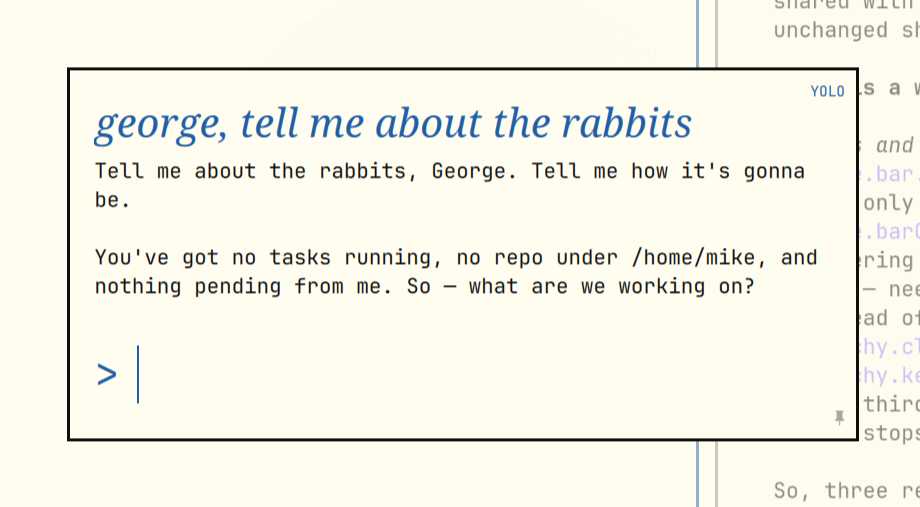

# Archy — the Omarchy guide

The guide that should come with [Omarchy](https://omarchy.org) — one
keypress away.
Archy grows with you — from your first boot to bending the OS to your will:

- **🚀 A live guided first tour.** Not a slideshow — Archy watches the
  compositor and verifies every step as you *actually do it*: open windows,
  close them keyboard-only, tile, float, switch workspaces, drive the menu.
  Eleven steps, about two minutes, and it starts by helping you connect
  your AI agent — the Omarchy way.
- **🎓 A learning path.** Fourteen stops from beginner to advanced,
  usage-aware: it skips what you already do daily.
- **👀 Gentle coaching.** "I noticed you haven't used workspaces — want to
  see how?" Evidence-based nudges, at most one a day, only for features you
  genuinely aren't using. Never a tip for a tip's sake.
- **💬 Answers to everything — about *your* machine.** The chat answers
  through your own configured Omarchy agent, grounded in the locally
  fetched official manual, your real live keybindings, and your machine's
  facts (terminal, browser, monitors). Omarchy-first answers: it says
  **SUPER+C**, not Ctrl+C. Real Markdown, and every file path it mentions
  is clickable — one click opens it in your editor.
- **🔧 "Do it for me."** Not ready to edit config files yourself? One button
  under the answer and Archy applies the fix — user-level config only,
  every file backed up first, the change verified, and the one-line undo
  reported back. Your click is the consent; nothing changes without it.
- **📚 It learns.** Verified facts and your corrections are appended to
  `LEARNED.md`, so it gets better on your machine over time.

No agent connected yet? The tour, learning path, coaching, and a curated
set of getting-started answers all work with no AI at all — and the first
thing Archy teaches is how to connect one.

## Install (Omarchy plugin — recommended)

    omarchy plugin add https://github.com/respira-crece-lidera/archy-omarchy.git --enable

The 👾 invader appears in your bar (place it with `omarchy bar put`).
**First click** runs Archy's one-time setup — with that click you consent to:
per-user config in `~/.config/omarchy-help/`, two user services
(`omarchy-help`, `omarchy-help-watch`), a Help entry merged (non-destructively)
into your Omarchy menu, and a one-shot welcome hook. Nothing touches system
files, nothing runs as root, no existing configuration is overwritten.

## Remove

    omarchy plugin remove io.github.respira-crece-lidera.archy
    systemctl --user disable --now omarchy-help omarchy-help-watch
    rm -rf ~/.config/omarchy-help ~/.local/share/omarchy-help \
       ~/.local/bin/omarchy-help* ~/.config/systemd/user/omarchy-help*
    # plus the "help" entry in ~/.config/omarchy/extensions/omarchy-menu.jsonc

## Dependencies

- `python` (stdlib only) and `curl` — required
- An AI agent for the chat and 🔧 tiers: whatever `omarchy default agent` is
  set to (Claude Code and Codex supported headless; the tour, learning path,
  starter chips, and coaching work with **no agent at all**)
- License: MIT. Markdown rendering (marked + DOMPurify) is vendored — no
  CDN, everything serves from 127.0.0.1.

## Install (manual / non-plugin)

    git clone https://github.com/respira-crece-lidera/archy-omarchy.git
    cd archy-omarchy && ./install.sh

Then run `omarchy-help`, find **Help** in the Omarchy menu (SUPER+SPACE), or
bind a key (the installer prints the one-liner). Removal is the same as the
plugin's minus the `omarchy plugin remove` line.

## Your AI, your account, your data

- **Archy has no backend and no API key of its own.** AI answers run through
  the agent *you* already set up on Omarchy (Claude Code or Codex), on your
  own subscription or credits. Archy is tuned to be cheap about it: chat
  answers use the fastest model tier (e.g. Haiku / low reasoning effort),
  and the tour, learning path, coaching, and starter answers cost nothing
  at all — they never call an AI.
- **We collect nothing.** No telemetry, no analytics, no accounts, no phoning
  home. Everything Archy knows about you — your questions, its LEARNED.md,
  your tour progress — lives in plain files on your machine and goes nowhere.
  The only network traffic is your own agent's API calls and the optional
  manual refresh from GitHub's public repo.

## Design notes

- Two small systemd **user** services: the widget server (Python stdlib,
  bound to 127.0.0.1) and the Hyprland-event watcher behind the tour and
  the coaching. No sudo, no telemetry, no root anything.
- The 🔧 mode is deliberately scoped: user-level config only, an explicit
  allowlist of commands, backup-before-edit, verify-after, undo reported.
- Machine-specific notes can go in `~/.config/omarchy-help/LOCAL.md` — the
  tutor reads it if present (useful for fleet/dotfile setups).
- Knowledge lives in plain Markdown — PRs that correct or extend
  KNOWLEDGE.md are the whole point.

## Credits

I built Archy for myself, learning Omarchy the way it deserves to be
learned — hands-on, keyboard-first, AI when it helps — and it grows the same
way: every rough edge I hit in daily use becomes the next improvement.

Created by **Luke Warren Wills** — [@lukemallorca](https://instagram.com/lukemallorca) on Instagram. Open source under the MIT license: use it, fork it, improve it.
